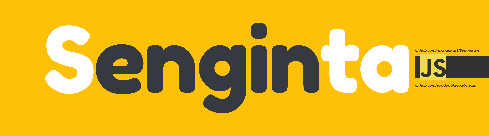

<p align="center">
    </img>
</p>

<p align="center">
    All in one Search Engine Scrapper for used by API or Node JS library. It's Free & Lightweight!
</p>

**`Documentation`** |
------------------- |
[]() |

Senginta is All in one Search Engine Scrapper. With traditional scrapping, 
Senginta can be powerful to get result from any Search Engine, and convert
to Json. Now support only for Google Product Search Engine (GShop, GVideo 
and many too) and Baidu Search Engine.

Senginta was originally developed by me alone. So, if you want to contribute for
support another search engine, let's fork this Repository. 

Senginta provides beta JavaScript.

## Install

```
$ cd <to-your-project-directory>
$ npm init
$ npm install senginta
```

#### Try your first Senginta program

```shell
$ node
```

```javascript
>>> const { GSearch, GNews, GBooks, GVideo, GShop, GScholar, BASearch } = require('senginta')
>>> const search_spider = new GSearch('study from home')
>>> async function try_GSearch(cb) {
        const result = await search_spider.get_all()
        cb(result)
    }
>>> try_GSearch((data) => console.log(data))
...
...
...
Object Formatting
```

## Resources

*   Let's contribute your blog about this module here!

## License

[MIT License](LICENSE)

## WARNING

All intended of use, the responsibility rests with you. So, use wisely!
